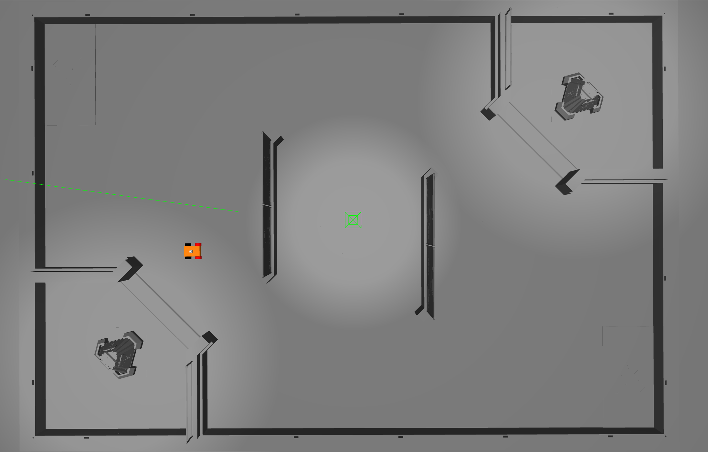
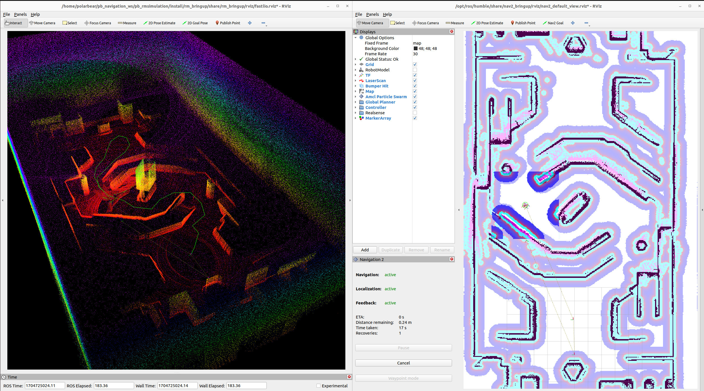

# PB_RM_Simulation

深圳北理莫斯科大学 北极熊战队 哨兵导航仿真包

## 一. 项目介绍

本项目使用麦克纳姆轮仿真小车，附加 Livox Mid360 雷达与 IMU，在 RMUC/RMUL 地图进行导航算法仿真。

功能演示视频：[寒假在家，怎么调车！？更适合新手宝宝的 RM 导航仿真](https://b23.tv/xSNQGmb)

|Gazebo 仿真|Fast_LIO + Navigation2|
|:-:|:-:|
|||

|Mid360点云仿真 + FAST_LIO 里程计 + 障碍物/地面点云分割 + 三维点云转二维 + Navigation2|
|:-:|
||

## 二. rm_simulation 话题接口

| **Topic name**      | **Type**                        | **Note**                         |
|:-------------------:|:-------------------------------:|:--------------------------------:|
| /livox/lidar             | livox_ros_driver2/msg/CustomMsg | Mid360 自定义消息类型   |
| /livox/lidar/pointcloud | sensor_msgs/msg/PointCloud2     | ROS2 点云消息类型                      |
| /livox/imu                | sensor_msgs/msg/Imu             | Gazebo 插件仿真 IMU                  |
| /cmd_vel            | geometry_msgs/msg/Twist         | 麦克纳姆轮小车运动控制接口                  |

## 三. 环境配置

当前开发环境为 Ubuntu22.04, ROS2 humble, Gazebo 11.10.0

1. 安装依赖

    ```bash
    sudo apt install -y ros-humble-gazebo-*
    sudo apt install -y ros-humble-xacro
    sudo apt install -y ros-humble-robot-state-publisher
    sudo apt install -y ros-humble-joint-state-publisher
    sudo apt install -y ros-humble-rviz2
    sudo apt install -y ros-humble-nav2*
    sudo apt install -y ros-humble-slam-toolbox
    sudo apt install -y ros-humble-pcl-ros
    sudo apt install -y ros-humble-pcl-conversions
    sudo apt install -y ros-humble-libpointmatcher
    sudo apt install -y ros-humble-tf2-geometry-msgs
    sudo apt install -y libboost-all-dev
    sudo apt install -y libgoogle-glog-dev
    ```

    后续编译与运行过程中如果有依赖功能包未安装，按类似的方法安装。

2. 安装 [Livox SDK2](https://github.com/Livox-SDK/Livox-SDK2)

    ```bash
    sudo apt install cmake
    ```

    ```bash
    git clone https://github.com/Livox-SDK/Livox-SDK2.git
    cd ./Livox-SDK2/
    mkdir build
    cd build
    cmake .. && make -j
    sudo make install
    ```

## 四. 编译运行

```bash
git clone --recursive https://gitee.com/SMBU-POLARBEAR/pb_rmsimulation --depth=1
```

```bash
cd pb_rmsimulation
./build.sh
```

### 可选参数

1. `world`:

    （仿真模式）
   - `RMUL` - [2024 Robomaster 3V3 场地](https://bbs.robomaster.com/forum.php?mod=viewthread&tid=22942&extra=page%3D1)
   - `RMUC` - [2024 Robomaster 7V7 场地](https://bbs.robomaster.com/forum.php?mod=viewthread&tid=22942&extra=page%3D1)

    （真实环境）
      - 自定，world 等价于 `.pcd(ICP使用的点云图)` 文件和 `.yaml(Nav使用的栅格地图)` 的名称，

2. `mode`:
   - `mapping` - 边建图边导航
   - `nav` - 已知全局地图导航

3. `localization` (仅 `mode:=nav` 时本参数有效)
   - `amcl` - 使用 [AMCL](https://navigation.ros.org/configuration/packages/configuring-amcl.html) 算法定位（经典算法）
   - `slam_toolbox` - 使用 [slam_toolbox](https://github.com/SteveMacenski/slam_toolbox) localization 模式定位（动态场景中效果更好）
   - `icp` - 使用 [ICP_Localization](https://github.com/baiyeweiguang/icp_localization_ros2) 算法定位（性能开销较多）

    Tips:
    1. 若使用 AMCL 算法定位时，启动后需要在 rviz2 中手动给定初始位姿。
    2. 若使用 slam_toolbox 定位，需要提供 .posegraph 地图，详见 [localization using SLAM_Toolbox](https://answers.ros.org/question/365472/localization-using-slam_toolbox/)
    3. 若使用 ICP_Localization 定位，需要提供 .pcd 点云图

4. `rviz`:
   - `True` - 可视化 robot_descrition, FAST_LIO
   - `False` - 仅提供 nav2 可视化窗口

### 仿真模式

- 示例：
  - 边建图边导航

      ```bash
      ros2 launch rm_bringup bringup_sim.launch.py \
      world:=RMUL \
      mode:=mapping
      ```

  - 已知全局地图导航

      ```bash
      ros2 launch rm_bringup bringup_sim.launch.py \
      world:=RMUL \
      mode:=nav \
      localization:=slam_toolbox
      ```

### 真实环境

- 示例：
  - 边建图边导航

    ```bash
    ros2 launch rm_bringup bringup_real.launch.py \
    world:=YOUR_WORLD_NAME \
    mode:=mapping
    ```

    Tips:

    1. 保存点云 pcd 文件：需先在 [fastlio_mid360.yaml](src/rm_bringup/config/fastlio_mid360.yaml) 中 将 `pcd_save_en` 改为 `true`，并设置 .pcd 文件的名称
    2. 保存栅格地图：需先在 [save_grid_map.sh](save_grid_map.sh) 将 `YOUR_MAP_NAME` 更改为与 .pcd 文件相同的名称。保存后在当前工作空间新开终端，运行 `./save_grid_map.sh` 即可
    3. 保存 .posegraph 地图：请参考 [localization using SLAM_Toolbox](https://answers.ros.org/question/365472/localization-using-slam_toolbox/)

  - 已知全局地图导航

    ```bash
    ros2 launch rm_bringup bringup_real.launch.py \
    world:=YOUR_WORLD_NAME \
    mode:=nav \
    localization:=slam_toolbox
    ```

    Tips: 栅格地图文件和 pcd 文件需具为相同名称，分别存放在 `src/rm_bringup/map` 和 `src/rm_bringup/PCD` 中，启动导航时 world 指定为文件名前缀即可。

### 小工具 - 键盘控制

```bash
ros2 run teleop_twist_keyboard teleop_twist_keyboard
```

## 致谢

Mid360 点云仿真：参考了 [livox_laser_simulation](https://github.com/Livox-SDK/livox_laser_simulation/blob/main/src/livox_points_plugin.cpp)、 [livox_laser_simulation_RO2](https://github.com/stm32f303ret6/livox_laser_simulation_RO2/blob/main/src/livox_points_plugin.cpp)、 [Issue15: CustomMsg](https://github.com/Livox-SDK/livox_laser_simulation/issues/15)

导航算法框架：基于 [中南大学 FYT 战队 RM 哨兵上位机算法](https://github.com/baiyeweiguang/CSU-RM-Sentry) 略微修改以适配仿真。

非常非常感谢以上开源项目 / Issue 的帮助！！！

## TODO

1. ~~将湖工大地图模型文件修改为动态路径~~（2023.9.30 完成）

2. ~~多线雷达~~（2023.10.8 完成）

3. ~~适配为 ROS2 Humble 版本~~ (2023.10.13 完成)

4. ~~完成 nav 的适配~~ （忘记记录时间了）

5. ~~优雅的选择地图，并根据不同地图适配小车出生点~~（2023.11.25完成）

6. 决策树

7. 优化 livox_laser_simulation 性能问题

## 常见问题

- Gazebo 无法正常启动？

  答：执行命令 `source /usr/share/gazebo/setup.sh`。

- Gazebo 没有生成小车？

  答：执行命令 `killall -9 gzserver` 和 `killall -9 gzclient` 确保 Gazebo 后台进程已完全清除，再重新启动即可。
